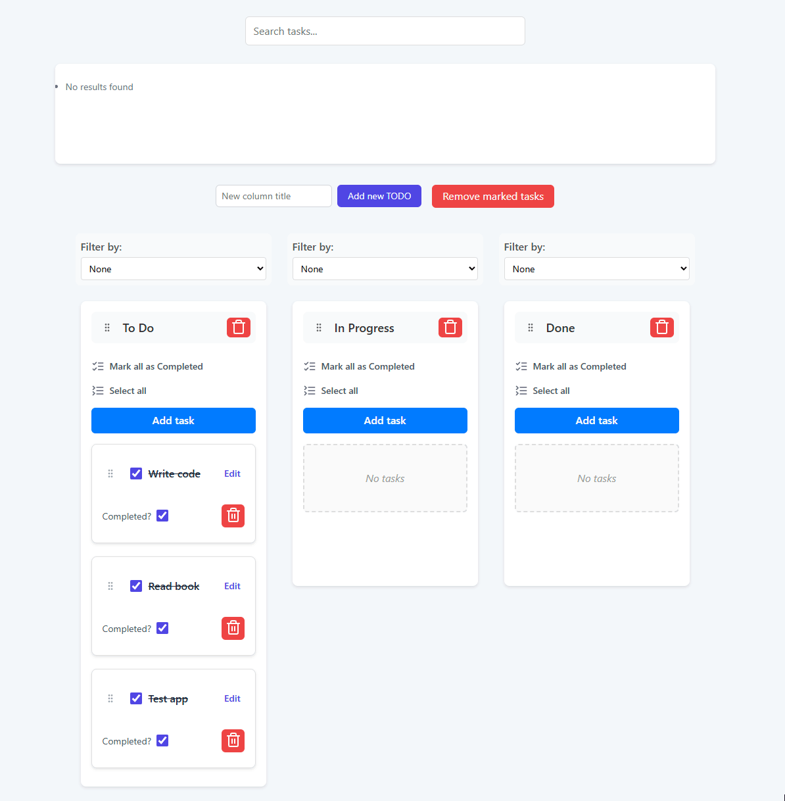
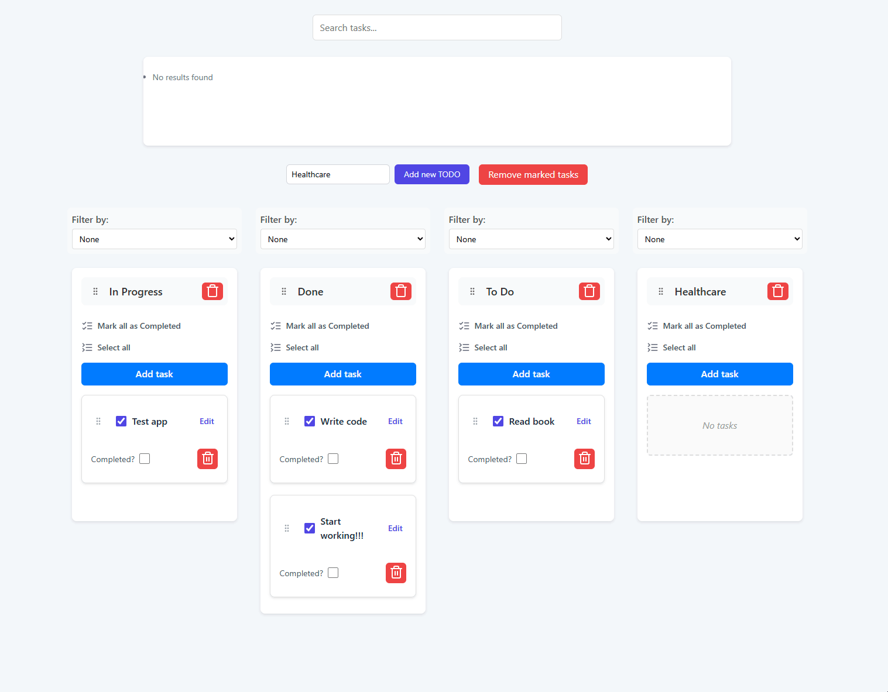

# Todo App

A TODO APP with DRAG n DROP built on React + Vite, TypeScript, Redux
[App Demo](https://zarichnyi.github.io/todo-app-recman/)

## Getting Started




### Prerequisites

- Node.js (v16 or higher recommended)
- npm (v8 or higher)

### Installation

Clone the repository:

```sh
git clone https://github.com/zarichnyi/todo-app-recman.git
cd todo-app-recman
```

Install dependencies:

```sh
npm install
```

### Running the Application

Start the development server:

```sh
npm run dev
```

Open [http://localhost:5173](http://localhost:5173) to view it in your browser.